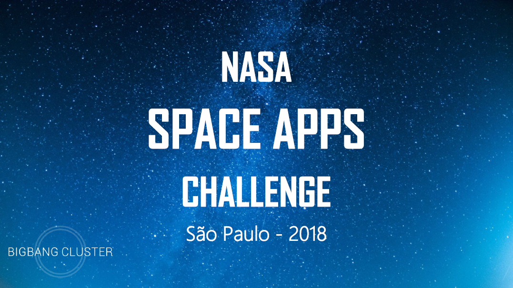
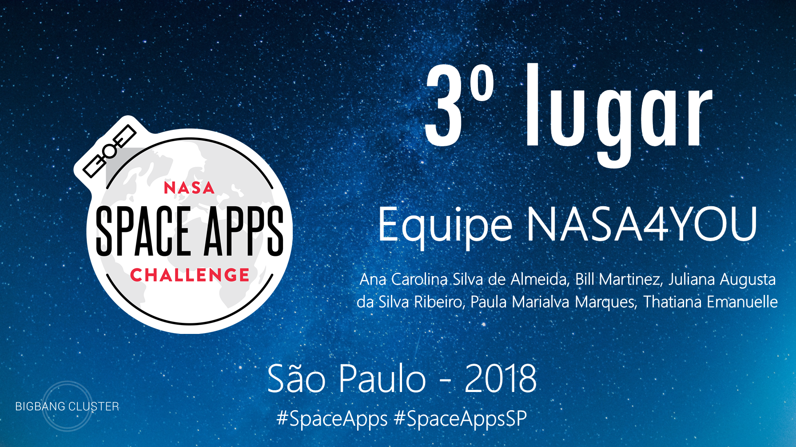

# Hackathon da NASA

## NASA International Space Apps Challenge

Space Apps 2018 Edital: **www.spaceappschallenge.org**

O intuito é utilizar de sua criatividade, para resolver os desafios propostos pela desafios propostos pela desafios propostos pela desafios propostos pela NASA. O evento conta com desafios de vários níveis diferentes, permitindo que crianças, jovens e adultos possam participar.

## O Desafio

### "O que o mundo precisa agora é..."
Os moradores da Terra precisam de muitas coisas: comida, água, ar puro, abrigos e tantas outras coisas – a lista é longa e diversificada. Quais são essas coisas? O que precisa para sustentar e melhorar a vida na Terra para todos nós habitantes? E o que iremos precisar, eventualmente, em outros planetas?
Desafios nesta categoria serão atacar em problemas que afetam aspectos importantes de vida neste mundo e ou em outros, e interpretar dados da NASA e conceitos para criativamente ajudar a buscar soluções.

### "Olhando globalmente (Analise e/ou exiba dados para comunicar descobertas interessantes ou melhorar a compreensão pública do nosso planeta)"

#### Experiência 
Com o aplicativo GLOBE Observer, a NASA coleta dados de cientistas cidadãos em todo o mundo que estão observando as nuvens, os habitats dos mosquitos e a cobertura da terra. Esses dados têm o potencial de serem exibidos ou usados em conjunto com os dados de satélite da NASA para identificar ou comunicar informações e para educar o público sobre o planeta Terra.
Por exemplo, vincular “observações terrestres” (observações feitas por cientistas cidadãos ao nível do solo) de nuvens a observações de satélite fornece uma perspectiva única, permitindo-nos ver os processos atmosféricos de dois pontos de vista muito diferentes.
Como outro exemplo de ciência cidadã em ação, os dados sobre a ocorrência de mosquitos podem ser vinculados a informações ambientais coletadas por meio de sensoriamento remoto para prever onde mais os mosquitos podem ser encontrados. Esta informação pode ser útil para os funcionários de saúde pública que desejam reduzir a propagação de doenças transmitidas por mosquitos, como a malária e a febre do vírus Zika.
De que maneiras você pode analisar e/ou exibir dados da NASA para comunicar descobertas interessantes ou melhorar a compreensão do público sobre o nosso planeta? Isso pode incluir plataformas técnicas, como aplicativos e/ou websites, mas também pode incluir usos criativos, como jogos, imagens ou vídeos.

#### Considerações
Os dados coletados de cientistas cidadãos consistem em fotografias, bem como informações descritivas - por exemplo, tipo de nuvens, porcentagem de cobertura de nuvens, tipo de habitat de mosquito, porcentagem de terra coberta por árvores, etc. Cada observação tem uma localização de latitude/longitude.
Os diferentes tipos de dados podem precisar ser exibidos de maneiras diferentes o Sistema de Visualização GLOBE e a Ferramenta de Acesso a Dados Avançados do GLOBE contêm dados de todos os protocolos do Programa GLOBE, não apenas aqueles coletados por meio do aplicativo GLOBE Observer. Você encontrará a camada Nuvens sob a seção Atmosfera, Mosquito Habitat Mapper sob Hydrosphere e Land Cover under Biosphere. Sinta-se à vontade para explorar os outros tipos de dados, se desejar.
O resumo de dados para pontos de dados em nuvens individuais no Sistema de Visualização GLOBE terá um link para uma página de correspondência de satélite, que indica se uma correspondência foi feita. Outros tipos úteis de dados (mais exemplos de fontes de satélite - consulte recursos para os locais de dados) para comparar com as observações de base da ciência do cidadão incluem:

- Clouds: Cloud Fraction (Aqua/MODIS, Terra/MODIS)
- Mosquito Habitat Mapper: Precipitation (GPM/IMERG), Soil Moisture (SMAP), Vegetation (Landsat, Terra/MODIS), Surface Temperature (Aqua/AIRS)
- Land Cover: Vegetation (Landsat, Terra/MODIS)
- Sinta-se livre para pensar criativamente! Um aplicativo de exemplo poderia criar um jogo em que os indivíduos testassem sua capacidade de conhecer um ambiente com base na visualização do espaço. O jogo daria aos jogadores uma escolha de imagens coletadas do aplicativo de cobertura terrestre e uma imagem de sensoriamento remoto óptico. Os jogadores podem escolher a imagem correta associada a esse local? Esse aplicativo ajudaria o público a se conectar com imagens de satélite e também poderia coletar dados sobre locais que são frequentemente identificados erroneamente. Esse recurso pode ser usado para descrever necessidades educacionais futuras ou identificar imagens que foram registradas incorretamente no aplicativo GLOBE.

#### Exemplos de Recursos
GLOBE Fonte de dados:
- GLOBE Observer App: https://observer.globe.gov, e pode ser baixado da App Store e do Google
Play. Não é necessário fazer o download do aplicativo para concluir esse desafio, mas coletar alguns dados por conta própria pode ser útil
- GLOBE Visualization System: https://vis.globe.gov. Exibe dados GLOBE em um mapa e permite que você veja informações detalhadas sobre pontos de dados individuais. Também permite o download de tabelas de dados de uma camada inteira ou de um subconjunto selecionado de uma camada. No momento, essa é a única maneira de acessar fotos tiradas como parte da coleta de dados, que deve ser feita atualmente para cada ponto de dados individualmente
- GLOBE Advanced Data Access Tool: https://datasearch.globe.gov. Essa ferramenta permite encontrar e recuperar dados GLOBE usando vários parâmetros de pesquisa diferentes. Você receberá um resumo de sites com dados disponíveis com base nos seus parâmetros de pesquisa. A partir desses sites, você pode refinar ainda mais sua pesquisa e / ou fazer o download dos dados em um arquivo CSV para análise detalhada. Um arquivo CSV de resumo também está disponível, resumindo os dados disponíveis para cada site
- Tutoriais para recuperar e visualizar seus dados: https://www.globe.gov/get-trained/using-the-globe-website/retrieve-and-visualize-your-data.
Fontes de dados de satélite:
- Global Imagery Browse Services (GIBS): https://earthdata.nasa.gov/gibs, fornece acesso a mais de 400 produtos de satélite
- NASA Worldview: https://worldview.earthdata.nasa.gov/, uma maneira fácil de visualizar dados GIBS no seu navegador
- NASA’s Earth Science Data Systems Program:
https://science.nasa.gov/earth-science/earth-science-data, descreve várias fontes de dados da ciência da Terra
- NASA Earthdata Search: https://search.earthdata.nasa.gov/, permite pesquisar, descobrir, visualizar, refinar e acessar os dados da NASA Earth Observation.

## Nossa equipe: NASA4YOU

### Proposta
A NASA4YOU é uma plataforma que extrai e organiza informações do acervo da NASA através de algumas integrações, para gerar uma interface simples e amigável que, utilizando a navegação e as preferências do usuário, oferece uma jornada personalizada e atraente. “NASA for Dummies”.

- Ana Carolina Almeida: Desenvolvedora front-end
- Bill Martinez: Design e UX
- Juliana Augusta Ribeiro: Desenvolvedora front-end 
- Paula Marques: Negócios e planejamento
- Thatiana Emanuelle da Cunha: Desenvolvedora front-end
